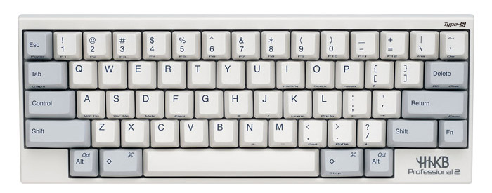
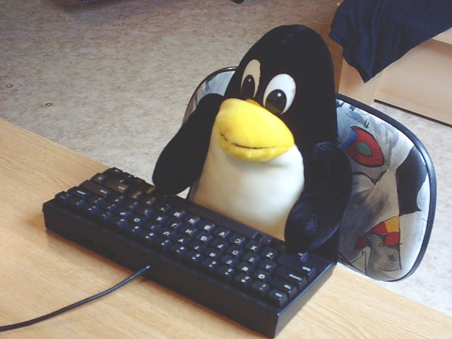
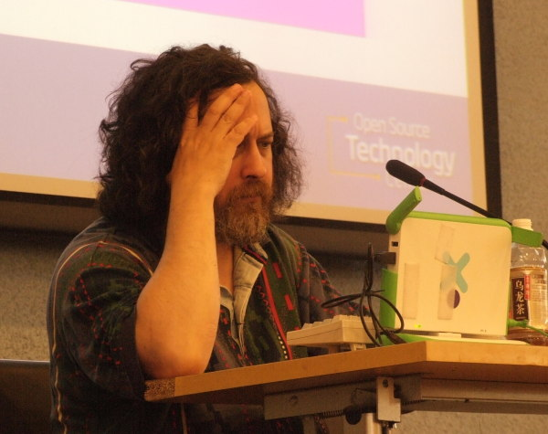
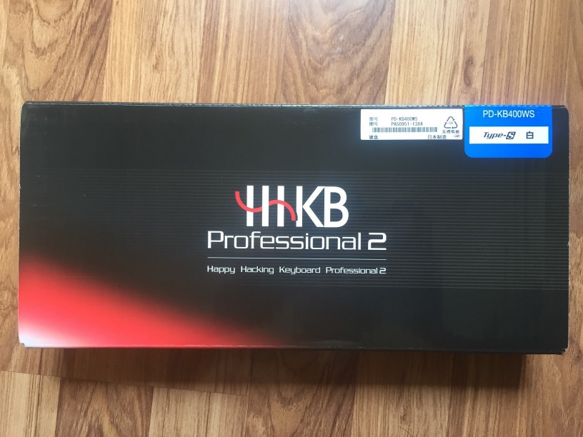
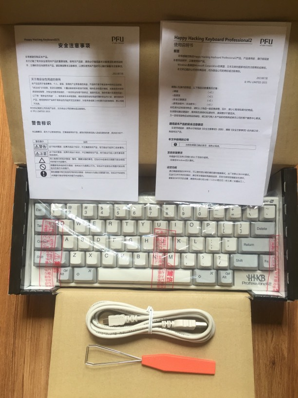
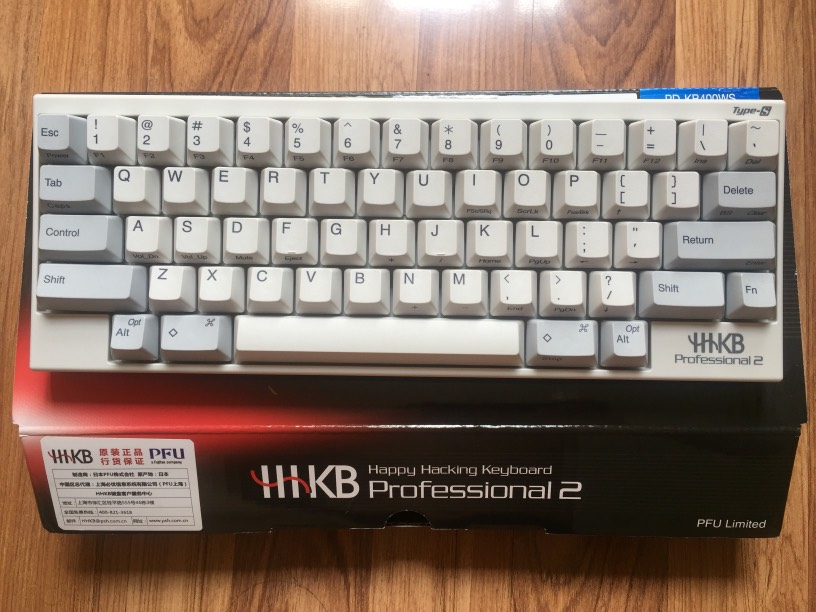
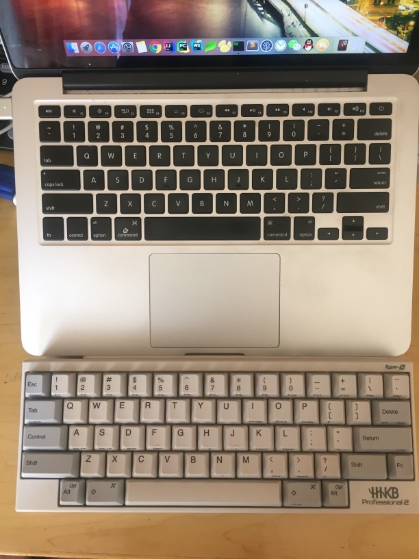
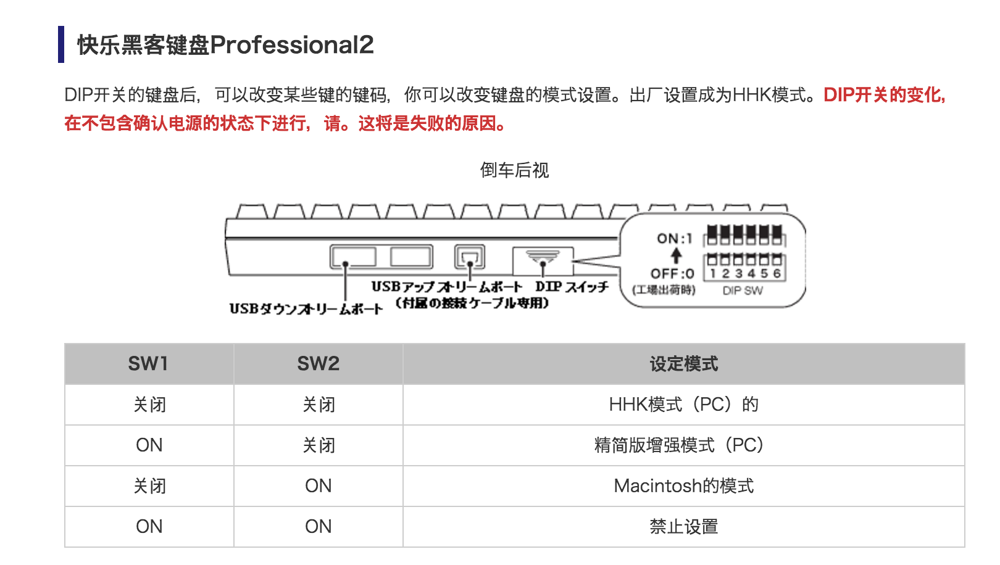
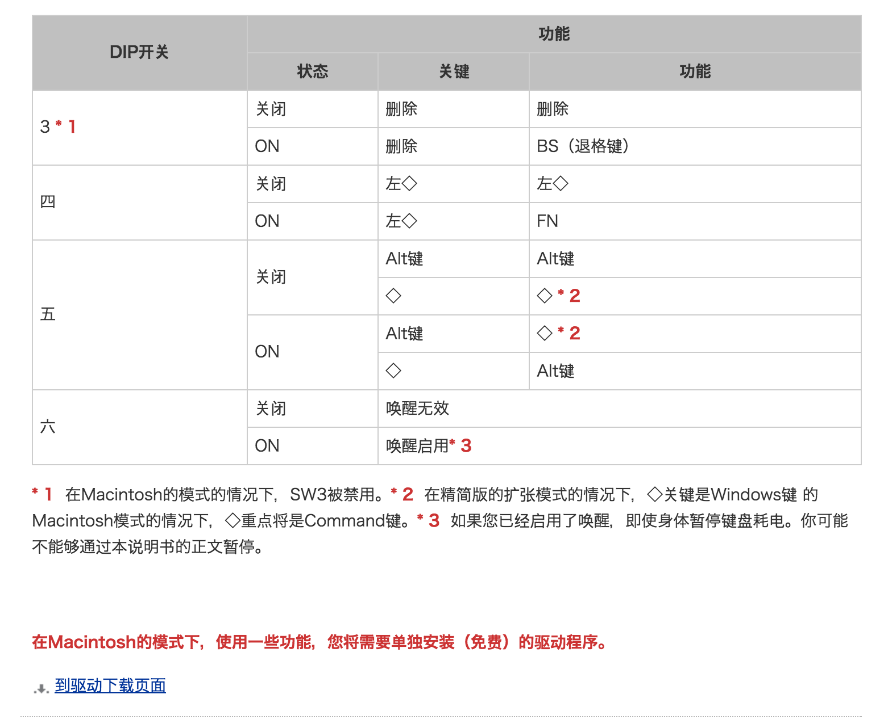

# 最后一个键盘 HHKB-PRO2-TypeS

[[toc]]

## 序

HHKB，全称叫做：`Happy Hacking Keyboard`，于 1996 年 12 月 20 日诞生于日本，由和田英一和株式会社 PFU 共同开发。

科普就不继续了，有兴趣的直接 [前往维基百科](https://zh.wikipedia.org/wiki/Happy_Hacking_Keyboard)

> **Happy Hacking Keyboard**（缩写为HHKB）是由株式会社PFU（富士通的全资子公司）所经销的计算机键盘。本键盘由和田英一和PFU研究所共同开发，于1996年12月开始销售。
> 
> 2004年荣获“商品设计部门”和“个人计算机及相关外设部门”的优秀设计奖

> 引用自[维基百科]

**贴一段HHKB中国官网首页的一段话：**

> 美国西部的牛仔们，会将死去的马儿留在原地，但是仍然会扛着马鞍长途跋涉，穿越一望无垠的沙漠。因为马儿是消耗品，而马鞍却是与人体融合在一起的“知己”。我们要有这样的观念：现在，电脑是消耗品，键盘却是传递情感，陪伴我们一生的“挚友”。

> [东京大学名誉教授 和田英一]

都说HHKB是码农神器，同时也是各路IT大神的钟爱之物。

Linux创始人 **Linus·Torvalds** 最爱

GNU 之父大胡子 **Richard Stallman**
下图是他100美元的OLPC配上250美元的HHKB Pro2，这才是真Geek。

当然还有C++之父 **Bjarne Stroustrup**

入手之前对比了HHKB Pro2和Pro2 Type-S，看到很多买了Pro2的继续迷恋Type-S，一不做二不休，直接入手**Pro2 Type-S**了。

## 开箱
去除外包装，露出真面目，右上角明显的Type-S标识。

背面来一张，果然是**静电容**的高级货

正式开箱，HHKB静静地躺在那里，还有说明书和mini-usb数据线(足足有2M长)，由于买的是PFU上海公司的行货，故说明书是中文的，白色有刻。

撕开封条，从保护膜中取出，放在盒子上再来一张正面。

来一张大合照

## 业内评价总结
0. 正如其名**Happy Hacking Keyboard** - 快乐骇客键盘，你将会很**Happy**；
1. 提供 6 个 DIP 开关，通过这些开关的组合，可以交换键盘上一些键的位置，或者是改变某些键的功能，让 HHKB 在 Windows/Linux/Mac OS 下工作；
2. 键盘寿命长。HHKB 采用静电容轴，按下键后，电容的容量会发生改变，实现按键触发效果。由于是无触点设计，所以磨损就较小；
3. 接口丰富。除了本身使用的一个 mini USB 口外，还额外提供了两个 USB 接口，方便扩展；
4. 键帽通过颜色分区。将功能区与输入区用颜色进行了分隔，整体相当有复古感觉，这也是很多键帽玩家所喜欢的配色方案；
5. 对强迫症患者友好。除了右边的 shift 与 fn 键之外，整体左右对称，非常符合强迫症患者的审美习惯。

## Mac 适配
再过一个月就不能叫OSX了，改叫MacOS了，不由感叹啊！由于自己长期使用Mac，当然第一要务就是适配，在这里要纠正一下网上各种教程所谓Mac上SW23开，其余关的谬论！HHKB背后写得很清楚，Macintosh只需要开SW2就可以，下面配上官网是配图，注意最下红色`*`号标注的第一行，Macintosh下，SW3无效，就是说你开和关都没用的，Mac下本来Delete和Backspace键是合二为一，这样才叫人性化啊。[点击前往下图原文](http://www.pfu.fujitsu.com/hhkeyboard/leaflet/hhkb_backview.html)

另外，图上还有一行红字

> 在Macintosh模式下，使用一些功能，需要单独安装驱动程序。
就是说，在你的Mac不能识别的时候，安装 [这个驱动](http://www.pfu.fujitsu.com/hhkeyboard/macdownload.html) 就OK了，还有如果安装了驱动，可以更好的支持Mac下面的一些原生快捷键(不需要键盘映射的)，所以还是推荐安装。

## 无折腾不码农
推荐一款折腾键位映射的开源工具**Karabiner**，安装后需要重启。
[猛击这里前往下载](https://pqrs.org/osx/karabiner/)

贴一张我自己的轻微折腾映射，对照设置就OK了

