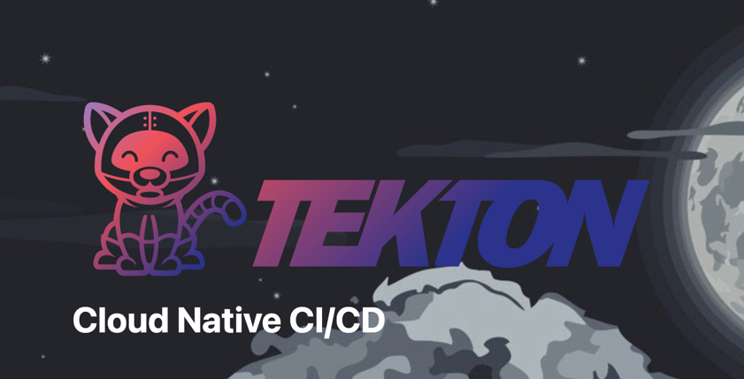
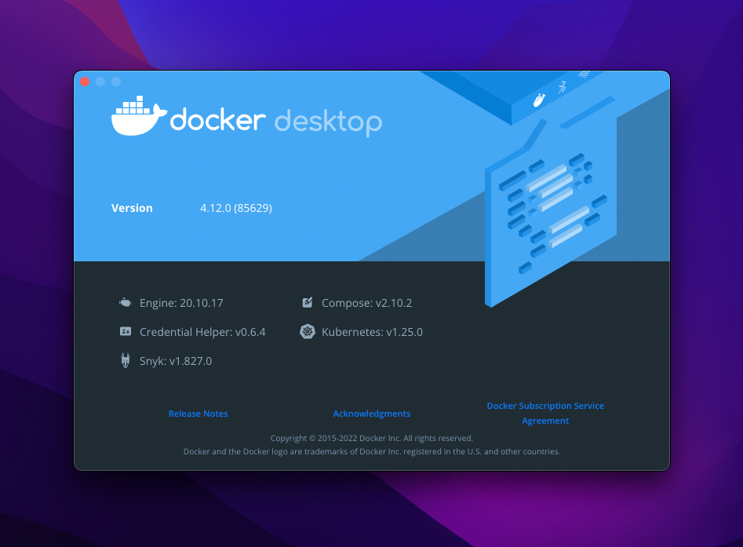

## 先来回答几个问题

**Tekton 是什么？**

> Tekton 是一个运行于 K8S 之上的，云原生 CI/CD 系统。

**Tekton 可以做什么？**

> 1. 编排 CI/CD 任务，执行 build 、test、deploy 等操作；
> 2. 基于容器的 Runtime，让 Tekton 不仅限于只是 CI/CD 工具，可以执行任何容器化编排任务；

**我们为什么要选择 Tekton？**

> 1. 运行环境基于 K8S，采用 Job 任务弹性执行；
> 2. 基于容器化运行时，可配置每一个任务调度可需要的资源，灵活性和可定制型很高；
> 3. 类似 Serverless 机制的按需调用服务器资源，利用率极高，不需要排队和等待；

<!-- more -->

## 用一张脑图认识 Tekton

...

## 创建一个 Kubernetes 集群

这里我没有采用官方文档提到的 `minikube`，而是直接使用了 `Docker-Desktop` macOS 图形客户端；



具体的安装方式点击这里：[Docker Desktop - Docker](https://www.docker.com/products/docker-desktop/)

## 安装 Tekton Pipelines

### 安装 Tekton Pipelines

```bash
kubectl apply --filename https://storage.googleapis.com/tekton-releases/pipeline/latest/release.yaml
```

Tekton 实际上只会安装两个 Pod，分别是 `tekton-pipelines-controller` 和 `tekton-pipelines-webhook`。

#### 解决无法下载 gcr.io 镜像的问题

```yaml
## 依赖需要的 gcr.io 镜像，可自行拉去后，推送到自己的镜像仓库，最后替换 Tekton Pipelines release.yaml 中的相关域名

gcr.io/tekton-releases/github.com/tektoncd/pipeline/cmd/controller:latest
gcr.io/tekton-releases/github.com/tektoncd/pipeline/cmd/kubeconfigwriter:latest
gcr.io/tekton-releases/github.com/tektoncd/pipeline/cmd/git-init:latest
gcr.io/tekton-releases/github.com/tektoncd/pipeline/cmd/entrypoint:latest
gcr.io/tekton-releases/github.com/tektoncd/pipeline/cmd/nop:latest
gcr.io/tekton-releases/github.com/tektoncd/pipeline/cmd/imagedigestexporter:latest
gcr.io/tekton-releases/github.com/tektoncd/pipeline/cmd/pullrequest-init:latest
gcr.io/tekton-releases/github.com/tektoncd/pipeline/cmd/workingdirinit:latest
gcr.io/tekton-releases/github.com/tektoncd/pipeline/cmd/webhook:latest

gcr.io/google.com/cloudsdktool/cloud-sdk:latest
distroless.dev/busybox:latest
mcr.microsoft.com/powershell:nanoserver:latest
```

### 检查是否安装成功

```bash
kubectl get pods --namespace tekton-pipelines --watch

# 输出示例
NAME                                           READY   STATUS    RESTARTS   AGE
tekton-pipelines-controller-54c7997dc7-ldnmr   1/1     Running   0          3d
tekton-pipelines-webhook-59987d7bfc-vn8gd      1/1     Running   0          3d
```

## 使用 Task 执行一个任务

### 创建并安装一个 Task

先定义一个 `hello-world.yaml`

内容为通过 echo 打印一个 Message，并且定义了一个 `MESSAGE` 参数

```yaml
apiVersion: tekton.dev/v1beta1
kind: Task
metadata:
    name: hello-world
spec:
    params:
      - name: MESSAGE
        type: string
        default: Tekton.
    steps:
        - name: echo
          image: alpine
          script: |
              #!/bin/sh
              echo "Hello" "$(params.MESSAGE)"
```

安装 Task 到 Tekton Pipeline 中

```bash
kubectl apply --filename hello-world.yaml
```

### 创建一个 TaskRun 并运行

定义一个 TaskRun `hello-world-run.yaml`

通过 `TaskRef` 引用上一步安装好的 `hello-world`
传入支持参数 `MESSAGE`

```yaml
apiVersion: tekton.dev/v1beta1
kind: TaskRun
metadata:
    name: hello-world-run
spec:
    serviceAccountName:  default
    taskRef:
        name: hello-world
    params:
      - name: MESSAGE
        value: Larry Koo
```

运行 Hello Task Run

```bash
kubectl apply --filename hello-world-run.yaml
```

通过以下命令可以观察运行日志

```bash
tkn taskrun logs hello-world-run
```

## 使用 Pipeline 执行一个任务

### 创建一个 Pipeline 并安装

先定义一个 `hello-pipeline.yaml`

```yaml
apiVersion: tekton.dev/v1beta1
kind: Pipeline
metadata:
    name: hello-pipeline
spec:
    params:
        - name: P_MESSAGE
          description: "This is a parameter for P_MESSAGE"
          type: string
          default: "I am a pipeline message."
    tasks:
        - name: echo-message
          taskRef:
              name: hello-task
          params:
              - name: MESSAGE
                value: $(params.P_MESSAGE)
```

安装 `hello-pipeline.yaml`

```bash
kubectl apply --filename hello-pipeline.yaml
```

### 运行一个 PipelineRun

先定义一个 `hello-pipeline-run.yaml`

```yaml
apiVersion: tekton.dev/v1beta1
kind: PipelineRun
metadata:
    name: hello-pipeline-run
spec:
    pipelineRef:
        name: hello-pipeline
    params:
        - name: P_MESSAGE
          value: Pipeline Run Message.
```

运行 Hello PipelineRun

```bash
kubectl apply --filename hello-pipeline-run.yaml
```

---

::: tip 总结
TektonCD 入门到这里就结束了，下一篇准备写一下项目中的实践经验和更深入的使用技巧。
:::

::: info 相关资源

- [Tekton 官方文档](https://tekton.dev/)
- [Kubernetes 官方文档](https://kubernetes.io/)
- [Docker Desktop](https://www.docker.com/products/docker-desktop/)

:::